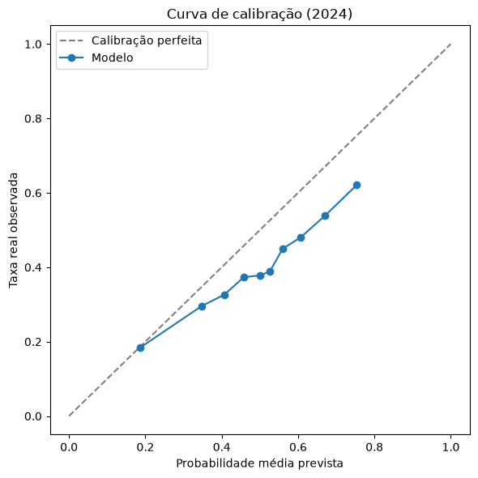
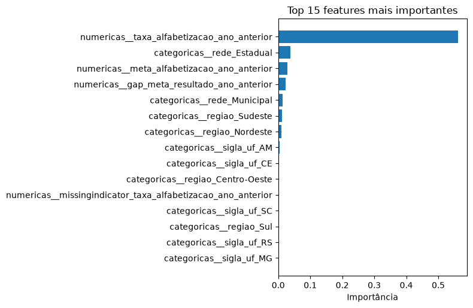
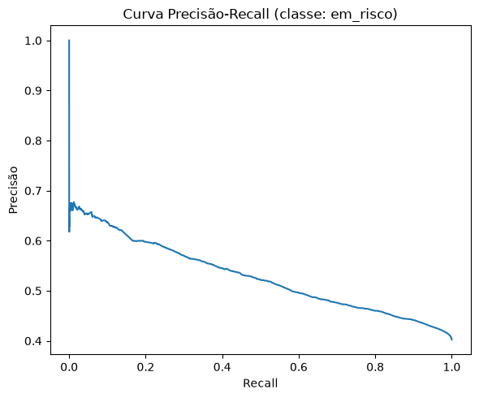
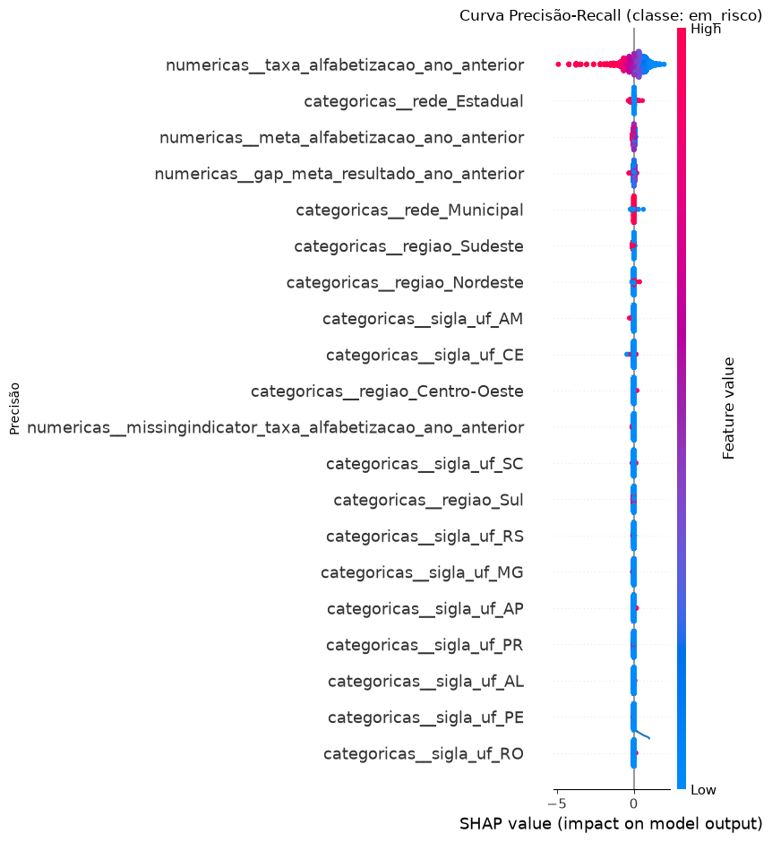

# Predição e Inteligência Analítica para Alfabetização no Brasil

Tech Challenge — Fase 3 (FIAP). Modelo supervisionado para prever se um aluno
será considerado alfabetizado ou não, a partir de variáveis educacionais,
territoriais e socioeconômicas da camada Gold construída na Fase 2.

## Contexto do problema

A alfabetização infantil é um dos principais indicadores do desenvolvimento
educacional e social do país. O **Compromisso Nacional Criança Alfabetizada**
define como alfabetizada a criança que atinge 743 pontos na escala de
proficiência do Saeb até o final do 2º ano do ensino fundamental, com meta
nacional de universalização até 2030. Conhecer os dados atuais não basta:
gestores públicos precisam antecipar riscos, identificar regiões vulneráveis
e entender quais fatores mais pesam nos indicadores educacionais.

## Objetivo analítico

Desenvolver um modelo supervisionado de classificação (alfabetizado /
não alfabetizado) e usá-lo, junto de análise exploratória e técnicas de
interpretabilidade (Feature Importance / SHAP), para responder perguntas de
negócio relevantes para políticas públicas — não apenas maximizar métricas.

## Descrição da base utilizada

Base construída na camada **Gold** do pipeline da Fase 2 (`FIAP - Tech
Challenge - Fase 2`, um repositório irmão deste, fora do escopo deste
repositório), dataset BigQuery `gold_alfabetizacao`, com as tabelas:

- `indicador_por_municipio` — Indicador Criança Alfabetizada por município;
- `comparacao_meta_resultado` — metas nacionais/estaduais/municipais vs. resultado real;
- `evolucao_temporal` — evolução temporal do indicador.

O enunciado do desafio lista fontes externas potenciais de enriquecimento
(IBGE, Censo Escolar, FUNDEB, PNAD, Atlas do Desenvolvimento Humano,
Cadastro Único); nenhuma delas foi incorporada nesta rodada — ver
"Limitações do projeto" e "Possíveis evoluções futuras" para o porquê.

A tabela efetivamente usada para treinar o modelo não é nenhuma das três
acima diretamente — é uma tabela nova, materializada especificamente para
esta fase (ver seção seguinte): `fiapfase2.gold_alfabetizacao.aluno_alfabetizado_enriquecido`,
com **3.355.846 linhas** (uma linha por aluno presente na avaliação, por
ano), cobrindo o período **2023-2024** (os dois únicos anos disponíveis na
Gold no momento desta análise). Ela une os microdados públicos de aluno
(fonte `basedosdados.br_inep_avaliacao_alfabetizacao.alunos`) com o
território/meta do município vindo de `indicador_por_municipio`.

A classe de interesse (`em_risco`, aluno não alfabetizado) é moderadamente
desbalanceada e estável entre os dois anos: **40,86%** no geral, sendo
**41,62%** em 2023 e **40,25%** em 2024 — desbalanceamento suficiente para
justificar `class_weight="balanced"` nos modelos e o uso de PR-AUC como
critério de seleção (ver "Escolha do algoritmo"), mas não tão extremo a
ponto de exigir técnicas de reamostragem.

Essa decisão de não incorporar fontes externas nesta rodada foi registrada
já na EDA e mantida deliberadamente fora de escopo (ver "Limitações do
projeto" e "Possíveis evoluções futuras").

## Etapas de modelagem

O detalhamento completo das decisões abaixo — com as alternativas
consideradas e descartadas — está no documento de design:
[`docs/superpowers/specs/2026-09-11-pipeline-modelagem-design.md`](docs/superpowers/specs/2026-09-11-pipeline-modelagem-design.md).
Resumo do que foi construído:

1. **Materialização de uma tabela Gold enriquecida.** Em vez de repetir o
   JOIN aluno↔território em cada notebook, um script em `src/preprocessing`
   materializa `aluno_alfabetizado_enriquecido` uma única vez no BigQuery:
   uma linha por aluno-ano (só alunos presentes na avaliação), enriquecida
   com o território/meta do município do **ano anterior** ao ano do aluno
   (ex.: aluno de 2024 recebe indicadores de 2023) — isso evita que o
   modelo veja, disfarçado de "contexto territorial", um resultado que só
   existiria depois do fato observado. Quando o ano anterior não existe na
   Gold (caso do cohort de treino de 2023, já que só há 2023/2024
   disponíveis), a lógica cai para o indicador do **mesmo** ano como
   *fallback* — uma concessão a uma limitação real de dado, detalhada em
   "Limitações do projeto".
2. **Split temporal, não aleatório.** Dentro de 2023, os dados são
   divididos 70% treino / 15% validação / 15% teste, estratificados por
   `em_risco`. Em número de linhas: **treino 1.052.140** / **validação
   225.459** / **teste-2023 225.459** — os três com `em_risco` = 41,62%,
   idêntico ao da população de 2023 antes do split, o que confirma que a
   estratificação está funcionando (não é só uma alegação, é uma checagem
   verificável). O ano de **2024 inteiro** (**1.852.788 linhas**,
   `em_risco` = 40,25%) é reservado como um segundo teste, *out-of-time* —
   nunca usado em treino ou ajuste de hiperparâmetros. A motivação é
   simular a pergunta real de negócio: o modelo treinado com dados de um
   ano consegue generalizar para o ano seguinte, ou só decorou padrões
   específicos de 2023? Um split aleatório comum (embaralhar tudo e
   separar 80/20) não responderia essa pergunta, porque deixaria linhas de
   2024 vazarem para o treino.
3. **Pré-processamento integrado ao modelo**, via
   `sklearn.pipeline.Pipeline` + `ColumnTransformer`: as features numéricas
   (`meta_alfabetizacao_ano_anterior`, `gap_meta_resultado_ano_anterior`,
   `taxa_alfabetizacao_ano_anterior`) passam por
   `SimpleImputer(strategy="median", add_indicator=True)`, e as
   categóricas (`rede`, `regiao`, `sigla_uf`) por
   `OneHotEncoder(handle_unknown="ignore")`. Os dois pontos importam para
   prevenção de vazamento: por estarem dentro do `Pipeline`, o imputador e
   o encoder são **ajustados (`fit`) somente no treino** e depois aplicados
   (sem reajustar) em validação, teste-2023 e 2024 — do contrário, a
   mediana ou as categorias usadas para preencher valores faltantes
   carregariam informação estatística do próprio conjunto que se está
   tentando avaliar de forma independente.
4. **Três modelos candidatos** (todos com `class_weight="balanced"` para
   compensar o desbalanceamento moderado da classe "em risco"):
   `LogisticRegression` (baseline interpretável), `RandomForestClassifier`
   e `HistGradientBoostingClassifier`. Os três são comparados **apenas na
   validação**, nunca no teste, para evitar um segundo tipo de vazamento —
   vazamento pelo próprio processo de avaliação (escolher o modelo
   "espiando" o teste).

## Escolha do algoritmo

O critério de seleção foi o **PR-AUC** (`average_precision_score`) medido
na validação — uma métrica que não depende de escolher um limiar de
decisão de antemão e que é mais informativa que a acurácia quando a classe
de interesse (aluno em risco de não alfabetização) não é maioria nem
minoria extrema (aqui, ~41% da base). Resultado da corrida:

| modelo | PR-AUC (validação) |
|---|---|
| **hist_gradient_boosting** | **0,5980** |
| regressão logística | 0,5958 |
| random forest | 0,5925 |

O `HistGradientBoostingClassifier` venceu, mas por margem pequena — a
diferença entre o 1º e o 3º colocado é de apenas ~0,006 em PR-AUC. A
consulta ao BigQuery usa `ORDER BY id_aluno, ano` explícito justamente
para que essa comparação — e todo o restante do notebook — seja
reprodutível: sem uma ordenação fixa, `SELECT *` no BigQuery retorna as
linhas em ordem arbitrária a cada execução, o que deslocaria o resultado
de `train_test_split` mesmo com seed fixa. O vencedor e a conclusão —
corrida acirrada entre os três candidatos, sem um modelo claramente
dominante — são os números desta execução reprodutível.

## Métricas de avaliação

O modelo vencedor (`hist_gradient_boosting`) foi avaliado **uma única vez**
contra dois conjuntos de teste que nunca participaram de treino ou seleção
de modelo: teste-2023 (linhas do mesmo ano de treino, nunca vistas) e o ano
de 2024 inteiro (*out-of-time*, um ano que o modelo nunca viu):

| conjunto | ROC-AUC | PR-AUC |
|---|---|---|
| Teste-2023 (mesmo ano) | 0,6878 | 0,5962 |
| 2024 (out-of-time) | 0,6388 | 0,5277 |

Há uma queda real de desempenho de 2023 para 2024 (~0,05 em ROC-AUC, ~0,07
em PR-AUC) — investigada na seção "Insights encontrados" abaixo, onde
mostramos que a causa principal é uma mudança na composição dos dados de
entrada (covariate shift), com um co-fator adicional discutido em
"Limitações do projeto".

Como a decisão de classificar um aluno como "em risco" depende de um
limiar sobre a probabilidade prevista, e a escolha desse limiar é uma
decisão de política pública (quanto o gestor está disposto a errar para o
lado de "alarme falso" vs. "caso perdido"), reportamos três cenários. Os
limiares são **escolhidos na validação** (nunca olhando para o teste-2024,
para não contaminar a única avaliação final com uma escolha feita a
partir dela) e depois aplicados, uma única vez, ao conjunto de 2024 — a
tabela abaixo mostra o limiar escolhido e a precisão/recall resultante
nesse teste:

| cenário | limiar (escolhido na validação) | precisão em 2024 | recall em 2024 |
|---|---|---|---|
| padrão (0,5) | 0,500 | 0,483 | 0,665 |
| otimizado para F1 | 0,392 | 0,445 | 0,869 |
| recall-prioritário (≥80%) | 0,434 | 0,461 | 0,796 |

Ver a leitura de negócio dessa tabela em "Aplicação prática para políticas
públicas".

## Comparação real vs. previsto (2024)

As métricas agregadas acima (ROC-AUC, PR-AUC, precisão/recall) resumem a
qualidade do modelo em um número, mas não mostram de forma direta "o
modelo previu X, a realidade foi Y" — a comparação mais concreta para
avaliar a capacidade real do modelo. Duas visões complementares:

**Matrizes de confusão em 2024**, para os três limiares escolhidos na
validação:

| cenário | verdadeiro positivo | falso positivo | falso negativo | verdadeiro negativo |
|---|---|---|---|---|
| padrão (0,500) | 495.985 | 531.832 | 249.684 | 575.287 |
| otimizado para F1 (0,392) | 647.798 | 807.143 | 97.871 | 299.976 |
| recall-prioritário (0,434) | 593.458 | 695.130 | 152.211 | 411.989 |

Em **todos** os três cenários, o número de falsos positivos supera o de
verdadeiros positivos — um primeiro sinal de que o modelo alarma mais do
que deveria em 2024.

**Curva de calibração**: divide as probabilidades previstas em 10 faixas
e compara a probabilidade média prevista com a taxa real observada em
cada faixa — responde "quando o modelo diz 70% de risco, isso corresponde
a uma frequência real de ~70%, ou o modelo está sistematicamente
otimista/pessimista?":



O modelo fica **sistematicamente abaixo da diagonal de calibração
perfeita** em toda a faixa de probabilidade — quando ele diz "50% de
risco", a taxa real observada é de só ~38%; quando diz "75%", a taxa real
é ~62%. O desvio cresce quanto maior a probabilidade prevista. Ou seja: o
modelo está **descalibrado por superestimação** em 2024, não apenas "um
pouco menos preciso" — as probabilidades previstas servem bem para
**ranquear** risco relativo entre alunos/municípios, mas não devem ser
lidas literalmente como "chance real de acontecer" nesse ano. Essa
descalibração é consistente com as duas causas discutidas em "Insights
encontrados" (covariate shift + vazamento fraco do fallback de 2023): o
modelo aprendeu, em 2023, um nível de risco "de base" mais alto do que o
que 2024 de fato apresenta.

## Interpretação dos resultados

Importância nativa de features do modelo vencedor (complementada por SHAP
quando a importância nativa não está disponível para todas as colunas
transformadas):

| feature | importância |
|---|---|
| `taxa_alfabetizacao_ano_anterior` | 0,562 |
| `rede_Estadual` | 0,037 |
| `meta_alfabetizacao_ano_anterior` | 0,029 |
| `gap_meta_resultado_ano_anterior` | 0,024 |
| `rede_Municipal` | 0,013 |
| `regiao_Sudeste` | 0,012 |
| `regiao_Nordeste` | 0,010 |





**Leitura em termos simples:** uma única variável — a taxa histórica de
alfabetização do próprio município no ano anterior — responde por mais de
metade do poder preditivo do modelo (0,562 de importância, contra 0,037 da
segunda colocada). Isso significa que o fator individual mais forte para
prever se *um aluno específico* será alfabetizado não é uma característica
pessoal daquele aluno, e sim o quão bem o município onde ele estuda já vem
performando recentemente. Em outras palavras: nascer/estudar num município
com histórico consistente de bons resultados é, isoladamente, o preditor
mais forte que este modelo encontrou — o que reforça a leitura de que
alfabetização é, em grande parte, um fenômeno territorial/sistêmico, e não
apenas individual. Rede de ensino (estadual vs. municipal) e a distância
entre meta e resultado do município aparecem como fatores secundários, mas
com peso bem menor.

## Insights encontrados

**1. Existe um gap real de generalização temporal.** O ROC-AUC cai de
0,6878 (teste-2023, mesmo ano de treino) para 0,6388 (2024, ano nunca
visto) — uma queda de ~0,05, com uma queda proporcional maior em PR-AUC
(0,5962 → 0,5277). Isso por si só não diz se o modelo "aprendeu errado" ou
se o mundo mudou entre 2023 e 2024; por isso, antes de aceitar o número,
rodamos um diagnóstico de variação temporal.

**2. O diagnóstico aponta covariate shift como causa principal.** Um teste
de Kolmogorov-Smirnov confirma que as 3 features numéricas mudaram de
distribuição de forma estatisticamente significativa entre 2023 e 2024
(p ≈ 0,0 nas três). O achado mais revelador está nas categóricas:
`sigla_uf = SP` (São Paulo) tinha **~0% de cobertura em 2023** e passa a
representar **21,6% dos alunos em 2024** na mesma fonte pública de dados.
Ou seja: São Paulo praticamente não aparecia na fonte de microdados de
aluno em 2023 e passou a aparecer de forma substancial em 2024 —
mecanicamente, isso desloca toda a distribuição das features (inclusive
`regiao = Sudeste`, que sobe de 24,1% para 40,8% só pelo efeito de SP
entrar). É uma mudança na **composição da amostra de dados disponível**,
não uma mudança real no comportamento educacional dos alunos — o modelo
não "piorou": ele está vendo, em 2024, uma população parcialmente
diferente (mais representativa de SP) daquela em que foi treinado, e essa
mudança de composição explica boa parte da queda de métrica observada.

**3. Um co-fator provável: a diluição do vazamento fraco do fallback de
ano em 2023.** A explicação de covariate shift acima não é a história
completa. Como "Limitações do projeto" detalha, o cohort de treino/teste
de 2023 se beneficia de um vazamento fraco e diluído: como 2023 não tem
um "ano anterior" real na Gold, a materialização usa o indicador
territorial do **mesmo ano** do aluno como fallback — e essa é justamente
a feature dominante do modelo, `taxa_alfabetizacao_ano_anterior` (0,562
de importância, mais da metade do total). Em 2024, o "ano anterior" é
genuinamente 2023 (sem fallback, sem essa vantagem). Ou seja: parte da
queda de 2023 para 2024 é provavelmente o desaparecimento mecânico dessa
vantagem otimista do fallback, não apenas covariate shift — as duas
explicações não são mutuamente exclusivas, e não temos, com os dois anos
de dado disponíveis, como isolar quanto cada uma contribui para o gap
observado.

**4. A descalibração por superestimação (ver "Comparação real vs.
previsto") é mais uma evidência a favor dessa mesma história.** Se o
modelo apenas tivesse perdido poder de discriminação em 2024 (menos
capacidade de separar quem está e quem não está em risco), esperaríamos
uma queda de ROC-AUC/PR-AUC sem um viés sistemático de direção. O que se
observa — o modelo superestimando risco de forma consistente e crescente
com a probabilidade prevista — é exatamente o padrão esperado quando um
"nível de base" aprendido em 2023 (parcialmente inflado pelo vazamento do
fallback) deixa de valer em 2024.

## Limitações do projeto

- **A Gold só tem 2 anos de dado (2023 e 2024).** Isso limita a validação
  temporal a uma única fronteira (treinar em 2023, testar em 2024) — não é
  possível confirmar se o gap de generalização observado é um padrão
  recorrente ou específico dessa transição de ano até que exista uma
  terceira safra de dado para comparar.
- **Nenhuma fonte externa foi incorporada nesta rodada** (IBGE, Censo
  Escolar, FUNDEB, PNAD, Atlas do Desenvolvimento Humano) — decisão
  deliberada para manter o escopo do desafio tratável; features como
  investimento por aluno (FUNDEB) ou nível socioeconômico (Censo/PNAD)
  provavelmente melhorariam o poder preditivo além do que o território
  histórico sozinho consegue capturar.
- **Não travamos um limiar de decisão único "oficial".** A tabela de
  limiares na seção de métricas apresenta 3 cenários porque a escolha do
  ponto de operação depende de uma restrição de capacidade operacional do
  gestor público (quantos casos ele consegue atender) que este desafio não
  fornece como dado real — travar um número aqui seria inventar uma
  restrição que não existe.
- **A pergunta "quais regiões têm padrões semelhantes" foi tratada apenas
  parcialmente.** A EDA (`notebooks/01_eda_gold_e_alunos.ipynb`) já indicou
  um padrão regional via teste de Kruskal-Wallis, mas isso não substitui
  uma clusterização completa (não-supervisionada) das regiões — que é uma
  tarefa de natureza diferente da pipeline de classificação construída
  aqui e fica como próximo passo (ver "Possíveis evoluções futuras").
- **O fallback de "ano anterior → mesmo ano" introduz um vazamento
  fraco e diluído no cohort de treino de 2023.** Como a Gold só tem
  2023/2024, alunos de 2023 não têm um "ano anterior" real disponível;
  nesse caso, a materialização usa o indicador territorial do **mesmo**
  ano do aluno em vez do ano anterior. Isso é uma concessão consciente, não
  um erro passado despercebido: o vazamento é qualitativamente diferente do
  vazamento por `proficiencia` (que reproduziria o target individual quase
  perfeitamente) porque aqui o valor é um agregado municipal, compartilhado
  por centenas ou milhares de alunos do mesmo município naquele ano — o
  sinal extra que "vaza" é fraco e diluído, não uma cópia disfarçada do
  rótulo. Ainda assim, é um viés otimista real no desempenho medido sobre o
  cohort de treino/validação/teste-2023 (o teste out-of-time de 2024 não
  sofre desse problema, porque para ele o ano anterior — 2023 — está
  genuinamente disponível). Alternativas descartadas: inverter qual ano é
  treino vs. teste (inverteria a narrativa de negócio, de "prever o
  futuro" para "prever o passado"); remover as features territoriais
  defasadas (reduziria demais o escopo de interpretabilidade, que é uma
  das perguntas de negócio centrais do desafio).
- **O modelo está descalibrado por superestimação em 2024** (ver
  "Comparação real vs. previsto"): a probabilidade prevista é
  sistematicamente maior que a taxa real observada, e o desvio cresce nas
  faixas de probabilidade mais alta. Na prática, isso significa que o
  **ranking** de risco entre municípios/alunos é a leitura confiável do
  modelo — comparar quem está em risco relativo a quem — mas o **valor
  numérico** da probabilidade não deve ser lido como uma estimativa
  calibrada de frequência real nesse ano específico.

## Aplicação prática para políticas públicas

O modelo permite estimar, para cada aluno, uma probabilidade de risco de
não alfabetização — e, agregando essas probabilidades por município, gerar
um **ranking de municípios prioritários** para ação. A tabela completa
está em [`reports/risco_por_municipio_2024.csv`](reports/risco_por_municipio_2024.csv),
e — por causa da descalibração encontrada na seção "Comparação real vs.
previsto" — ela traz o risco **previsto** e o risco **real observado**
lado a lado, não só a previsão isolada:

| município | risco previsto | risco real (2024) | leitura |
|---|---|---|---|
| 2919900 | 0,944 | 0,875 | boa concordância — risco alto confirmado |
| 1718501 | 0,942 | 0,500 | superestimado — risco real é moderado, não extremo |
| 2205581 | 0,935 | 0,545 | superestimado |
| 1717800 | 0,932 | 0,548 | superestimado |
| 1718006 | 0,932 | 0,617 | superestimado, mas ainda o 2º maior risco real da lista |

Isso muda a leitura prática do ranking: o município 2919900 é o único, entre
os cinco de maior risco *previsto*, onde a previsão e a realidade
praticamente coincidem — os outros quatro têm risco real bem menor que o
previsto, ainda que continuem acima da média geral (40,25% em 2024). Um
gestor que for usar esse ranking para alocar recursos deve tratar a coluna
`risco_previsto` como um **ordenador** (quem priorizar primeiro), e
conferir a coluna `risco_real` — quando disponível, como neste caso
retrospectivo de 2024 — antes de dimensionar o tamanho da intervenção.
Esse tipo de ranking ainda é diretamente acionável: em vez de distribuir
recursos (formação de professores, material didático, reforço escolar) de
forma uniforme entre todos os municípios, um gestor estadual ou federal
pode priorizar onde o modelo indica maior concentração de risco relativo —
com a ressalva de calibração acima.

A tabela de limiares (seção "Métricas de avaliação") existe justamente
para dar ao gestor público — não ao modelo — o controle sobre um trade-off
que é uma decisão de política, não uma decisão técnica:

- **Limiar recall-prioritário (limiar escolhido para recall ≥ 80% na
  validação):** aplicado ao teste-2024, captura ~80% dos alunos realmente
  em risco (recall 79,6%), ao custo de uma precisão menor (46,1%) — ou
  seja, entre os alunos sinalizados, mais da metade não estava de fato em
  risco. Faz sentido quando o custo de "deixar passar" um caso real é alto
  (ex.: uma política de reforço escolar barata e escalável, onde é
  aceitável incluir alguns alunos que não precisariam).
- **Limiar padrão (0,5):** um meio-termo (66,5% de recall, 48,3% de
  precisão em 2024).
- **Limiar otimizado para F1:** maximiza o equilíbrio entre as duas
  métricas (86,9% de recall, 44,5% de precisão em 2024) — captura quase
  todos os casos de risco, mas com a menor precisão das três opções.

Em outras palavras: quanto mais o gestor prioriza **não deixar nenhum caso
de risco passar despercebido**, mais recursos serão direcionados também a
alunos que, na prática, não precisariam — e vice-versa. Como este desafio
não define a capacidade operacional real de nenhuma rede de ensino
(quantos alunos um programa de reforço consegue atender), a decisão de
qual cenário usar fica deliberadamente com quem vai operacionalizar a
política, não com o modelo.

## Possíveis evoluções futuras

- **Incorporar fontes externas** (IBGE, Censo Escolar, FUNDEB, PNAD, Atlas
  do Desenvolvimento Humano) para capturar fatores socioeconômicos e de
  investimento que o território histórico, sozinho, não representa.
- **Clusterização regional completa** para responder de forma robusta
  "quais regiões apresentam padrões semelhantes" — a EDA já indicou padrão
  regional (Kruskal-Wallis), mas uma análise não-supervisionada dedicada
  (ex.: k-means ou clusterização hierárquica sobre indicadores municipais)
  daria uma resposta mais completa e seria um ciclo de trabalho próprio.
- **Relatório de completude de cobertura territorial**, não mudar o
  fallback de ano: hoje a checagem de disponibilidade do ano anterior usa
  o mínimo global da tabela de território, não uma checagem por
  município — e isso é intencional, não uma limitação a corrigir. Uma
  checagem por `(id_municipio, ano)` pareceria "mais precisa", mas na
  prática faria o fallback de mesmo-ano disparar com mais frequência para
  municípios que reportam com atraso em cargas futuras (cobertura
  não-uniforme entre municípios) — injetando *mais* do vazamento fraco e
  diluído que "Limitações do projeto" já discute, não menos. O mínimo
  global é a escolha conservadora: quando falta dado de território para
  um município/ano, essas colunas ficam `NULL` (capturadas pelo
  `SimpleImputer(add_indicator=True)`), que é o modo de falha seguro
  contra vazamento. Uma evolução genuinamente útil aqui seria um
  **relatório de completude** (quais municípios/anos não têm dado de
  território disponível) para tornar essa lacuna visível, sem tocar na
  lógica do fallback em si.
- **Monitoramento e retreino periódico**, uma vez que mais anos de Gold
  estejam disponíveis — permitiria confirmar se o gap de generalização
  observado entre 2023→2024 é uma tendência recorrente (mudança de
  cobertura geográfica ano a ano) ou um evento pontual, e automatizar a
  decisão de quando retreinar o modelo.

## Estrutura do repositório

```
.
├── data/                 # dados (brutos/processados) usados no projeto
├── notebooks/            # notebooks de EDA e experimentação
├── src/
│   ├── preprocessing/    # limpeza, imputação, encoding
│   ├── modeling/         # treinamento e seleção de modelo
│   ├── evaluation/       # métricas e validação
│   └── visualization/    # gráficos e visualizações
├── reports/              # relatórios e documentação de decisões
├── images/               # imagens usadas em relatórios/README
├── requirements.txt
└── README.md
```

## Como reproduzir

```bash
python -m venv venv
source venv/bin/activate
pip install -r requirements.txt
```

Autentique-se no Google Cloud (a pipeline lê e escreve no BigQuery):

```bash
gcloud auth application-default login
```

Depois, execute o notebook de ponta a ponta (materializa a tabela Gold
enriquecida no BigQuery, treina e seleciona o modelo, e regrava os
artefatos em `reports/`):

```bash
venv/bin/jupyter nbconvert --to notebook --execute \
  notebooks/02_preprocessing_e_modelagem.ipynb \
  --output 02_preprocessing_e_modelagem.ipynb
```

## Vídeo executivo

> _TODO: link do vídeo executivo (até 5 min)._
