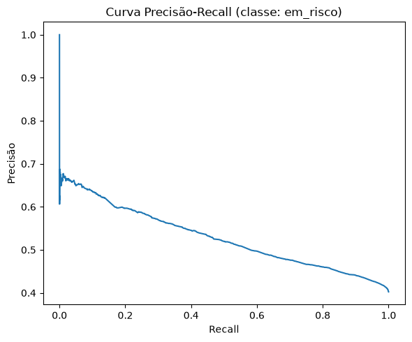
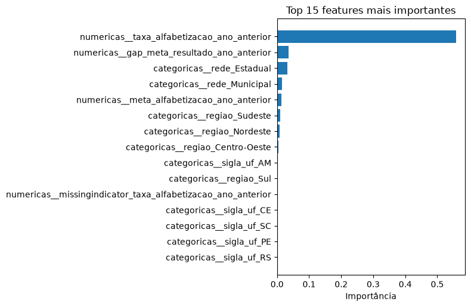
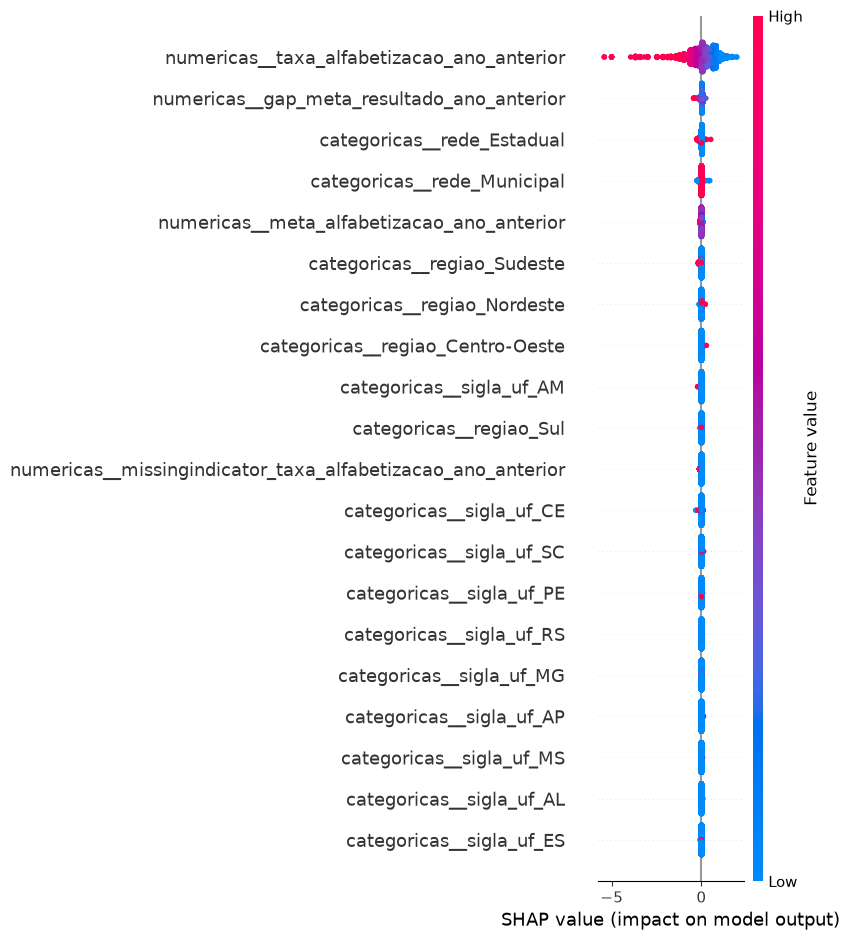
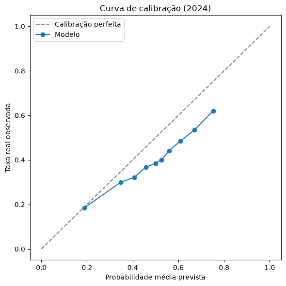
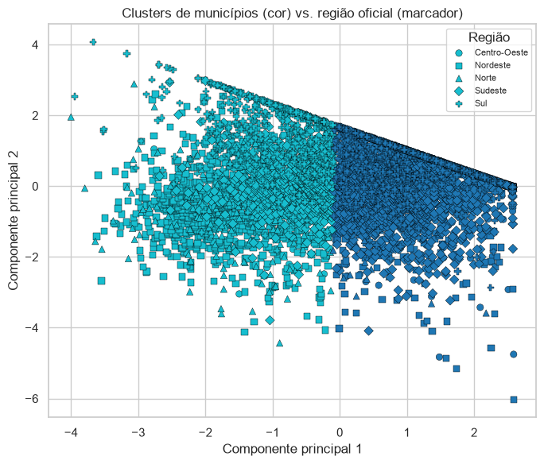

# Relatório de resultados — leitura visual

**Projeto:** Predição e Inteligência Analítica para Alfabetização no Brasil
— Tech Challenge Fase 3
**Escopo deste documento:** reunir todas as imagens geradas pelo projeto
(`reports/*.png`) num único lugar, cada uma acompanhada da explicação do
que ela mostra, por que foi gerada e o que se conclui a partir dela. Para
as decisões metodológicas por trás de cada resultado, ver
[`documentacao_tecnica.md`](documentacao_tecnica.md); para a leitura
executiva completa, ver o [`README.md`](../README.md) do projeto.

O modelo vencedor é o `HistGradientBoostingClassifier`, escolhido por
validação cruzada (PR-AUC médio 0,5969 em 5 folds) e avaliado, uma única
vez, contra dois conjuntos de teste nunca usados em treino: teste-2023
(mesmo ano) e teste-2024 (*out-of-time*, um ano inteiro nunca visto). Todas
as imagens de desempenho abaixo (curva precisão-recall, calibração,
matrizes de confusão) referem-se ao **teste-2024**, o cenário mais
relevante para o uso real do modelo — prever risco no ano seguinte ao
treinado.

---

## 1. Curva Precisão-Recall (classe: `em_risco`)

**O que é:** para cada limiar de decisão possível (de "quase ninguém é
classificado como risco" até "quase todo mundo é"), a curva mostra o par
(recall, precisão) resultante. Recall = de todos que realmente estão em
risco, quantos o modelo capturou; precisão = dos que o modelo marcou como
risco, quantos realmente estavam.

**Como ler esta curva:** ela começa perto de precisão 1,0 em recall muito
baixo (os poucos casos em que o modelo está mais confiante tendem a
acertar), cai rapidamente para um patamar entre ~0,60 e ~0,68 numa faixa
ampla de recall baixo-a-médio, e depois declina de forma gradual até
~0,41 quando o recall se aproxima de 1,0 (limiar próximo de zero,
praticamente todo mundo classificado como "em risco"). O ponto de
referência para "nenhuma capacidade preditiva" seria uma linha horizontal
na prevalência da classe (~40,25% em 2024) — a curva do modelo fica
visivelmente acima dessa linha na maior parte do intervalo de recall, o
que confirma que o modelo tem poder discriminativo real, mesmo sendo
moderado (PR-AUC = 0,5273 em 2024 — ver seção "Limitações" na
documentação técnica).

**Por que essa métrica, e não a curva ROC:** a classe de interesse
(`em_risco = 1`) é minoritária (~41% da base) — PR-AUC pondera melhor o
desempenho nessa classe do que ROC-AUC, que também premia (de forma
enganosamente otimista aqui) o acerto na classe majoritária.

---

## 2. Importância de features (top 15)

**O que é:** a importância nativa do `HistGradientBoostingClassifier` para
cada coluna já transformada pelo pré-processamento (prefixo `numericas__`
ou `categoricas__` indica de qual bloco do `ColumnTransformer` a feature
veio; sufixos como `_Estadual` ou `_Sudeste` são as categorias expandidas
pelo one-hot encoding).

**Como ler este gráfico:** uma única barra domina completamente o
gráfico — `taxa_alfabetizacao_ano_anterior`, com importância de 0,559 (mais
da metade do total). Todas as outras 14 barras visíveis somadas não chegam
a alcançá-la; a segunda colocada (`gap_meta_resultado_ano_anterior`) tem
importância de apenas 0,036 — quinze vezes menor. As barras praticamente
invisíveis no fim da lista (`sigla_uf_*` individuais, `missingindicator`)
mostram que o modelo dá pouquíssimo peso a UFs específicas ou ao próprio
indicador de valor ausente, isoladamente.

**O que isso significa:** o histórico municipal de alfabetização é,
isoladamente, o preditor mais forte que este modelo encontrou — mais forte
que rede de ensino, região, ou meta municipal combinados. Ver a ressalva
importante sobre isso (preditivo ≠ acionável) na seção 3 abaixo e na
documentação técnica.

---

## 3. SHAP summary plot — direção do efeito de cada feature

**O que é:** enquanto a importância de features (seção 2) só diz **quanto**
cada variável pesa, o SHAP mostra também **em que direção** — cada ponto é
um aluno da amostra usada para o cálculo (3.000 alunos de 2024), sua
posição horizontal é o quanto aquela feature empurrou a previsão daquele
aluno específico para cima (mais risco) ou para baixo (menos risco), e sua
cor é o valor da própria feature para aquele aluno (vermelho = valor alto,
azul = valor baixo).

**Como ler este gráfico:** na linha do topo
(`taxa_alfabetizacao_ano_anterior`, a feature dominante), os pontos
vermelhos (município com taxa histórica **alta**) concentram-se do lado
esquerdo do zero — **reduzindo** o risco previsto — enquanto os pontos
azuis (taxa histórica **baixa**) aparecem mais à direita, **aumentando** o
risco previsto. É a direção esperada e interpretável: estudar num
município com bom histórico de alfabetização reduz o risco previsto para
aquele aluno; estudar num município com histórico fraco aumenta. As linhas
seguintes mostram o mesmo tipo de leitura para as features secundárias,
com dispersão bem menor (efeito mais fraco), consistente com a
concentração de importância vista na seção 2.

**Por que isso importa para o relatório executivo:** é essa leitura de
direção (não só de magnitude) que permite responder, para um stakeholder
não técnico, "por que este aluno/município específico está marcado como
risco alto?" — não apenas "quais variáveis o modelo usa mais".

---

## 4. Curva de calibração (2024)

**O que é:** agrupa os alunos de 2024 em 10 faixas pela probabilidade de
risco prevista, e compara — em cada faixa — a probabilidade **média
prevista** (eixo X) com a taxa **real observada** de `em_risco` naquela
faixa (eixo Y). A linha tracejada diagonal representa calibração perfeita:
"quando o modelo diz X% de risco, X% dos casos daquela faixa são risco de
verdade".

**Como ler este gráfico:** a linha azul (o modelo) fica **sistematicamente
abaixo** da diagonal de calibração perfeita, em toda a faixa de
probabilidade — o modelo superestima o risco. Nas faixas mais baixas, a
diferença é pequena (previsto ~19% → real ~19%, praticamente calibrado).
A partir da faixa dos ~50%, a diferença cresce visivelmente: previsto ~50%
→ real ~38%; previsto ~75% → real ~62%. Ou seja, o desvio de calibração
**cresce junto com a probabilidade prevista** — o modelo não está "um
pouco errado em todo lugar", está progressivamente mais otimista quanto
maior o risco que ele próprio prevê.

**Implicação prática (documentada em "Comparação real vs. previsto" no
README):** as probabilidades deste modelo servem bem para **ranquear**
risco relativo entre alunos/municípios (quem está pior que quem), mas o
valor numérico não deve ser lido literalmente como "chance real de
acontecer" em 2024 — por isso todo relatório de risco por município deste
projeto (`reports/artefatos/risco_por_municipio_2024.csv`) traz o risco previsto
**e** o real lado a lado, nunca a previsão isolada.

---

## 5. Clusterização de municípios — cor (cluster) vs. marcador (região)

**O que é:** cada ponto é um dos 5.232 municípios com indicadores
completos em 2024, projetado num plano 2D via PCA (só para permitir
visualização — o k-means que definiu os clusters rodou nas 3 features
originais, não nesse espaço reduzido). A **cor** indica o cluster
encontrado pelo k-means (k=2, escolhido por silhueta); o **formato do
marcador** indica a região oficial do IBGE do município.

**Como ler este gráfico:** os dois clusters (azul-escuro à direita,
azul-claro à esquerda) se separam de forma quase nítida ao longo do eixo
horizontal (Componente Principal 1) — essa componente captura a maior
parte da variação nos 3 indicadores territoriais (`taxa_alfabetizacao`,
`gap_meta_resultado`, `meta_alfabetizacao_2024`), então PC1 funciona quase
como um "eixo de desempenho territorial". O ponto central da leitura está
nos **marcadores**: dentro de cada bloco de cor, aparecem **todos os 5
formatos de marcador** (círculo, quadrado, triângulo, losango, cruz) —
nenhuma região forma um bloco visualmente puro de uma cor só. Isso
confirma numericamente o que o crosstab já mostrava: a região oficial é um
proxy razoável do padrão territorial (regiões como Sul/Sudeste/Centro-Oeste
concentram mais pontos do lado de alto desempenho; Norte/Nordeste,
mais do lado de baixo desempenho), mas **não coincide** com ele — há
municípios "fora do padrão" espalhados por todas as regiões.

---

## Síntese: como as 5 imagens se conectam

| imagem | pergunta que ajuda a responder |
|---|---|
| Curva Precisão-Recall | O modelo tem poder preditivo real, e quão bom é esse trade-off? |
| Importância de features | Quais fatores mais impactam a alfabetização? |
| SHAP summary | Em que direção cada fator empurra o risco previsto? |
| Curva de calibração | A probabilidade prevista pode ser lida como chance real? |
| Clusters de municípios | Quais regiões apresentam padrões semelhantes? |

As cinco imagens, lidas em conjunto, contam uma história consistente: o
modelo tem poder discriminativo real mas moderado (imagem 1), dominado por
um único fator territorial-histórico (imagens 2-3) que é preditivo mas não
uma alavanca de política pública direta, superestima risco de forma
crescente em 2024 (imagem 4) — o que reforça que seu uso correto é
ranquear prioridade relativa, não ler probabilidades literalmente — e essa
mesma dimensão territorial, quando clusterizada de forma não-supervisionada,
revela um padrão de "alto vs. baixo desempenho" que atravessa as fronteiras
regionais oficiais (imagem 5).
